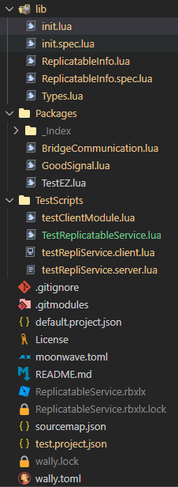

# Roblox Studio (New Icons) for Visual Studio Code

This is an Icon Theme Extension that will change certain folders and files
into custom icons that are commonly used when developing Roblox projects. These icons are previewed below:

---

## Installation
You can install Roblox Studio (New Icons) with the .vsix file located
in the [latest release](https://github.com/dev-syn/roblox-vscode-icon-theme/releases/latest)
or either installing it from the [Visual Studio Marketplace](https://marketplace.visualstudio.com/items?itemName=dev-syn.roblox-vscode-icon-theme-new).

Note: If you wish to install the extension from a .vsix file then you must do one of the following:

1. Double click the .vsix file to start the installation proccess.
2. "Extensions: Install from VSIX" command in in the Command Palette.
3. Install from the CLI(Terminal) by running `code --install-extension the_extension.vsix`.

## Changelog
This projects follows [Keep a Changelog](https://keepachangelog.com/en/1.0.0/) that list changes made through versions.

## License
Released under the MIT License.

---

## Icon Credit

> (.lua, .luau, server.lua, server.luau, client.lua, client.luau and .rbxlx)
> file icons is property of [Roblox Corporation](https://www.roblox.com/home).
>
> wally.toml icon is property of [Uplift Games](https://github.com/UpliftGames/).
>
> Moonwave icon is property of [eryn L. K.](https://eryn.io/moonwave/).
>
> Keep A Changelog icon is property of [Olivier Lacan](https://olivierlacan.com).
>
> Snippet icon is property of [GitLab Icon & Illustration Set](https://gitlab.com/gitlab-org/gitlab-svgs?ref=iconduck.com) icons can be viewed at [IconDuck](https://iconduck.com/sets/gitlab-icon-and-illustration-set).